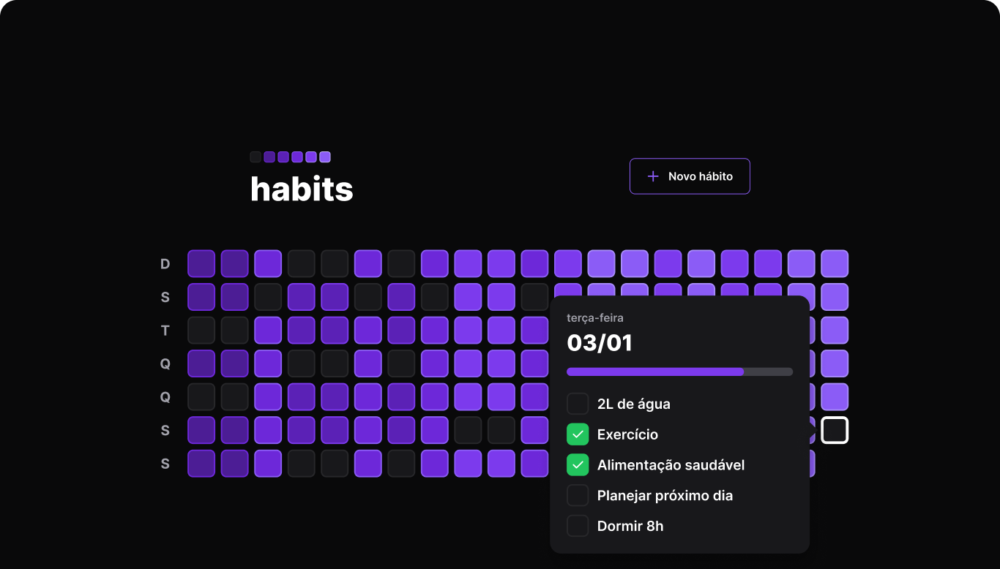

  

 

  
    

# NLW SETUP
Aplicação de ponta a ponta desenvolvida durante o evento NLW da Rockeseat. O projeto foi desenvolvido em três frentes: `Back-end`, `Front-end` e `Mobile`  

  - [Back-End](https://github.com/RenanFachin/RS_NLW_Setup/tree/main/server)
  - [Front-End](https://github.com/RenanFachin/RS_NLW_Setup/tree/main/web)
  - [Mobile](https://github.com/RenanFachin/RS_NLW_Setup/tree/main/mobile)

 
 

## ✔️ Autores

- [Renan Fachin](https://github.com/RenanFachin/)

## 📄 Professores

- [Rodrigo Gonçalves](https://github.com/rodrigorgtic)
- [Diego Fernandes](https://github.com/diego3g)

## 📄 Referência

- [Rockeseat](https://www.rocketseat.com.br/)