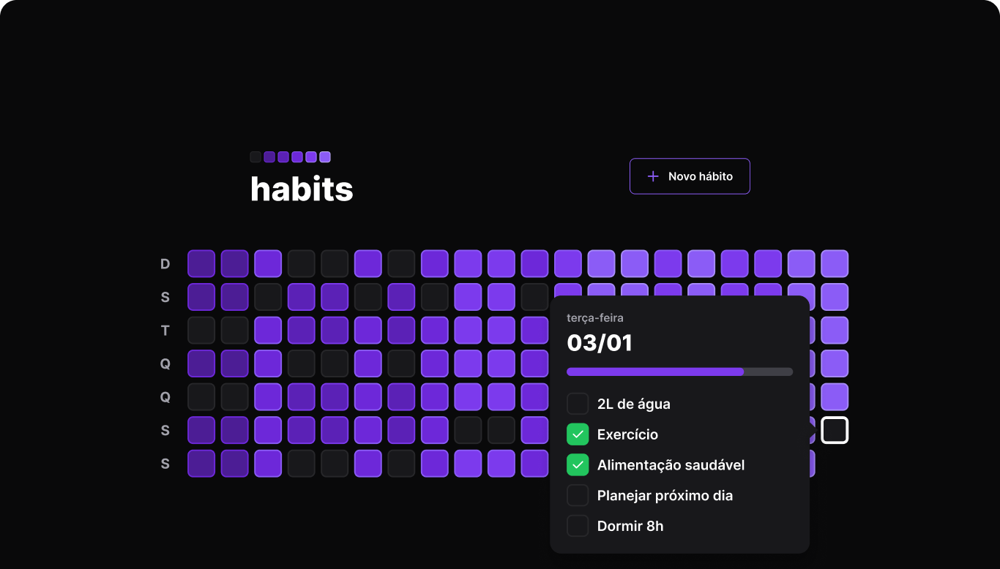

<div align="center" >
  
</div>
<br>

<div style="display: flex; justify-content:center; gap: 30px">
  
    
</div>

## O que é?
Back-end para a aplicação que registra os hábitos.

## Rotas
- Obter o resumo dos hábitos
```bash
GET /summary
```

- Obter os hábitos possíveis referente à uma data
```bash
GET /day?{date}
```

- Alternar o estado de um hábito específico
```bash
PATCH /habits/{id}/toggle
```

- Criar um hábito
```bash
POST /habits
```

## Diagrama ERD
<div align="center">
    
</div>


## Instalação
Faça o clone do repositório e acessar na pasta server

```bash
git clone https://github.com/RenanFachin/RS_NLW_Setup

cd server
```

Rodando o banco de dados
```bash
npx prisma migrate dev
```

Instalando as dependências
```bash
npm i
```

Rodando o servidor
```bash
npm run dev
```

